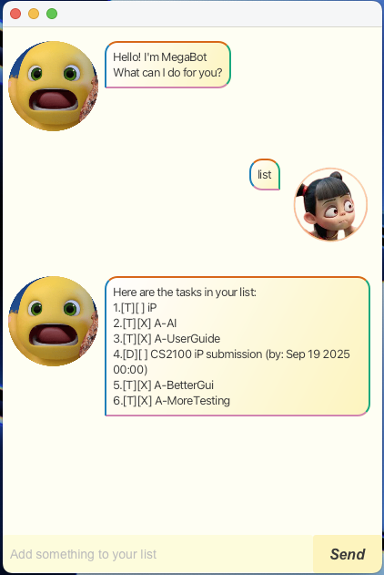

# MegaBot User Guide



MegaBot is a friendly task management chatbot that helps you organize your todos, deadlines, and events. With its intuitive GUI interface and persistent storage, MegaBot makes task management simple and efficient!

## Getting Started
When you first launch MegaBot, you'll be greeted with a welcome message. Simply type your commands in the input field and press Enter or click the Send button to interact with MegaBot.

## Adding Tasks

// Describe the action and its outcome.
Add a simple task without any time constraints.

**Command:** `todo <description>`

**Example:** `todo read book`

**Expected Output:**
```
Got it. I've added this task:
[T][ ] read book
Now you have 1 tasks in the list
```

### Deadline Tasks
Add a task that needs to be completed by a specific date/time.

**Command:** `deadline <description> /by <date>`

**Date Formats:**
- `YYYY-MM-DD` (e.g., 2024-12-25)
- `YYYY-MM-DD HHMM` (e.g., 2024-12-25 1800)

**Example:** `deadline submit assignment /by 2024-03-15 2359`

**Expected Output:**
```
Got it. I've added this task:
[D][ ] submit assignment (by: Mar 15 2024 23:59)
Now you have 2 tasks in the list
```

### Event Tasks
Add a task that occurs during a specific time period.

**Command:** `event <description> /from <start-date> /to <end-date>`

**Example:** `event project meeting /from 2024-03-10 /to 2024-03-15 1400`

**Expected Output:**
```
Got it. I've added this task:
[E][ ] project meeting (from: Mar 10 2024 to: Mar 15 2024)
Now you have 3 tasks in the list
```

## Managing Tasks

### Viewing All Tasks
Display all tasks in your list with their current status.

**Command:** `list`

**Expected Output:**
```
Here are the tasks in your list:
1.[T][ ] read book
2.[D][ ] submit assignment (by: Mar 15 2024 23:59)
3.[E][ ] project meeting (from: Mar 10 2024 to: Mar 15 2024)
```

### Marking Tasks as Done
Mark a completed task with an 'X'.

**Command:** `mark <task-number>`

**Example:** `mark 1`

**Expected Output:**
```
Nice! I've marked this task as done:
[T][X] read book
```

### Unmarking Tasks
Remove the completion mark from a task.

**Command:** `unmark <task-number>`

**Example:** `unmark 1`

**Expected Output:**
```
OK, I've marked this task as not done yet:
[T][ ] read book
```

### Deleting Tasks
Remove a task from your list permanently.

**Command:** `delete <task-number>`

**Example:** `delete 2`

**Expected Output:**
```
Noted. I've removed this task:
[D][ ] submit assignment (by: Mar 15 2024 23:59)
Now you have 2 tasks in the list
```

## Finding Tasks

### Search by Keyword
Find all tasks containing a specific keyword (case-insensitive).

**Command:** `find <keyword>`

**Example:** `find book`

**Expected Output:**
```
Here are the matching tasks in your list:
1.[T][ ] read book
```

If no tasks match your keyword:
```
No matching tasks found for keyword: homework
```

## Exiting the Application

### Say Goodbye
Close MegaBot gracefully with a farewell message.

**Command:** `bye`

**Expected Output:**
```
Bye. Hope to see you again soon!
```

The application will automatically close after displaying the goodbye message.


## Task Status Icons

- `[ ]` - Task not completed
- `[X]` - Task completed
- `[T]` - Todo task
- `[D]` - Deadline task
- `[E]` - Event task

## Data Persistence

MegaBot automatically saves your tasks to `./data/megabot.txt` after each command. Your tasks will be restored when you restart the application, so you never lose your progress!

## Error Messages

MegaBot provides helpful error messages when something goes wrong:

- **Empty descriptions:** "OOPSIE!! The description of todo cannot be empty."
- **Invalid task numbers:** "OOPSIE!! Task number X does not exist."
- **Wrong date format:** "OOPSIE!! The deadline format is invalid. Please use YYYY-MM-DD or YYYY-MM-DD HHMM format."
- **Missing keywords:** "OOPSIE!! Please specify a keyword to search for."
- **Invalid commands:** "OOPSIE!! Unknown command type found"

## Tips for Better Usage

1. **Date Formats:** Always use the correct date format (YYYY-MM-DD) to avoid errors
2. **Task Numbers:** Remember that task numbers start from 1 and change when you delete tasks
3. **Keywords:** Use descriptive keywords when searching to find tasks quickly
4. **Descriptions:** Make your task descriptions clear and specific for better organization

Happy task managing with MegaBot! 